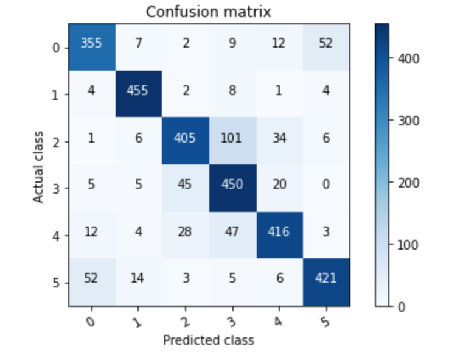
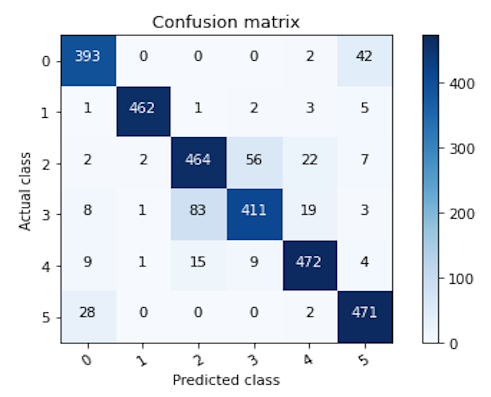
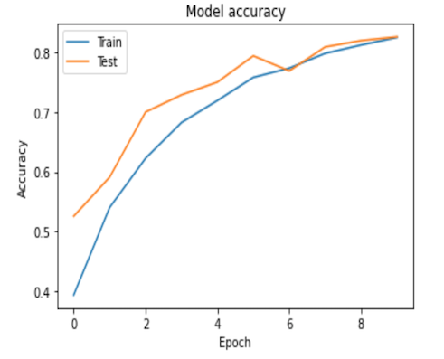
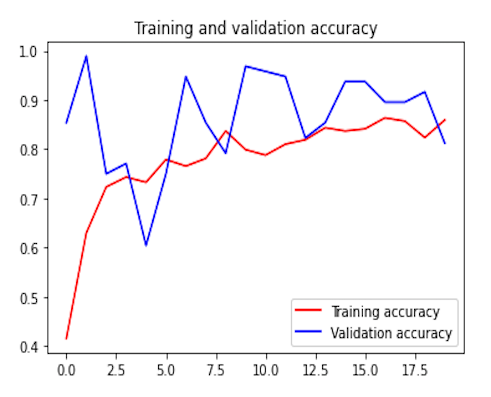
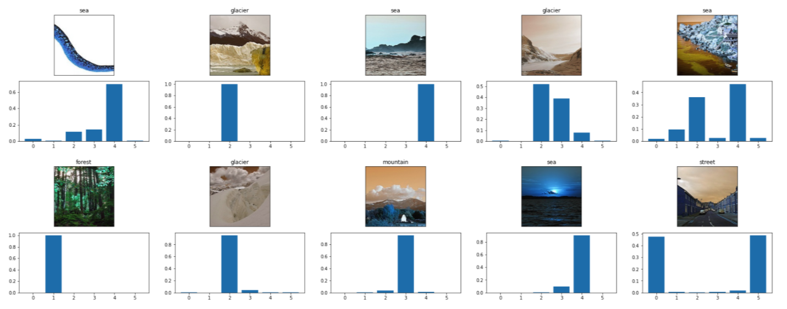

# Convolution Neural Network(CNN) with TensorFlow and Transfer Learning
### Confusion matrix of the basic CNN          ---------------------Confusion matrix of CNN with transfer learning                        
                 

                   

 # The Scope of The Project
Making two different CNN models with Image data sets such as basic CNN model and CNN model with transfer learning, and investigate impact of transfer learning on the performance of the CNN model.

# Introduction
In this workshop, I will show you how to build Convolution Neural Network(CNN) with/without transfer learning og Inception . I will use [Intel image data set](https://www.kaggle.com/puneet6060/intel-image-classification) that is very famous among "Kagglers" who is specially interested in Neural Network. The data sets consist of the number of images of 5 different classes. The size the photos er 150x150x3 which means each photo has 67,500 features(pixels). Also the data set consist of train and test sets. Train sets dimension is (14034x67500) that means there are 14034 different photos in the train set while the test set dimension is (3000x67500). I took the weights of the Inception model from [here](https://www.kaggle.com/keras/inceptionv3).

**Metric:** I used "accuracy metric" as a metric to evaluate model performance.

**Train set splitting:** I used 14034 photos as train set and 3000 photos as test set.

# Hyperparameter Tuning with KERAS TUNER

Hyperparameter tuning is heart of  CNN model and it directly affects the performance of the model. We can tune hyperparameters such as:

**Learning Rate :** It determines how quick the model will learn. It should be selected carefully. If it is small, the model speed will be very slow which means the derivative 
of loss function goes to its minimum point very slowly. If it is very high, the derivative of the loss fucntion cannot reach to its global minimum point. 
Therefore I preffered to choose its values as 1e-2, 1e-3, 1e-4.

**The number of nodes:** Nodes are points of the Layers on CNN. We need to optimize them and it is very general that they can be choosen as 32,64,128,256 and 512. 

**The number of layer:** It determines the complexity of the CNN model like the nodes. If you choose very high number, it can result in "BİAS". If you choose very small like 2,
it may not be good to solve complex and non-linear problems. We use dense function to create layers.

**Activation function:** Normally CNN is the linear method (Z=W*X+b), but we use activation function to make CNN non-linear. The most famous activation functions are relu and 
tanh for layers. If you use binary classification, you need to use "sigmoid" funcion. If you classify more than 2 classes, you need to use "softmax" function.

**L2 Regularization:** Regularization is used to reduce "VARİANCE" problem. One of the regularization techniques is L2 that is added to loss function to punish the weights.
By doing this weights getting closer to zero which reduces the model complexity.

**Dropout:** It is another regularization techniues. It is based on to close some of nodes randomly in determined layers. It uses "BERNOULLİ PROBABLİTY" to determine which nodes 
is getting closed. It is very effective like L2 regularization. It is very commen to use both L2 and Dropout regularization.

**Adam optimazation:** There are different optimazation methods like "momentum" and "RMSProp" to speed the model and increase the model performance. "ADAM" optimization technique
uses noth momentum and RMSProp(Root Mean Square Prop)

**Batch-size:** It is based on to divide data into small datasets and train them. It increase the performance beside speeding model training time. Exponentially weighted avarages 
statistical technique is used to calculate avarage loss on this technique. 

# Conclusion
CNN is a very powerful algorithm.I make two different model as basic CNN and CNN with transfer learning. I used pre-trained weights of the Inception model and freezed all layers which means that they didnot get tunned. As we can see confusion matrices above, the complex CNN model  is very capable to distinguish images and better than the basic one. **Test accuracy of the complex model** reached **90%** while the basic one reached **83%**. But still there is way we need to step up. Hyperparameter tuning is the heart of an CNN algorithms and we can use different range of parameters to make the CNN model tuning better. Tuning takes very long time therefore I suggest you to use **GPU**. 

# Some Images and Their Predictions

